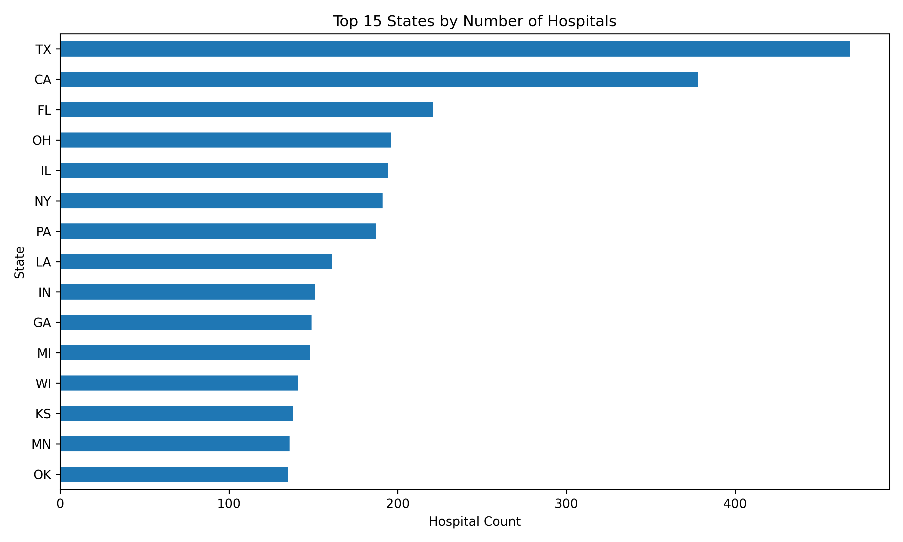
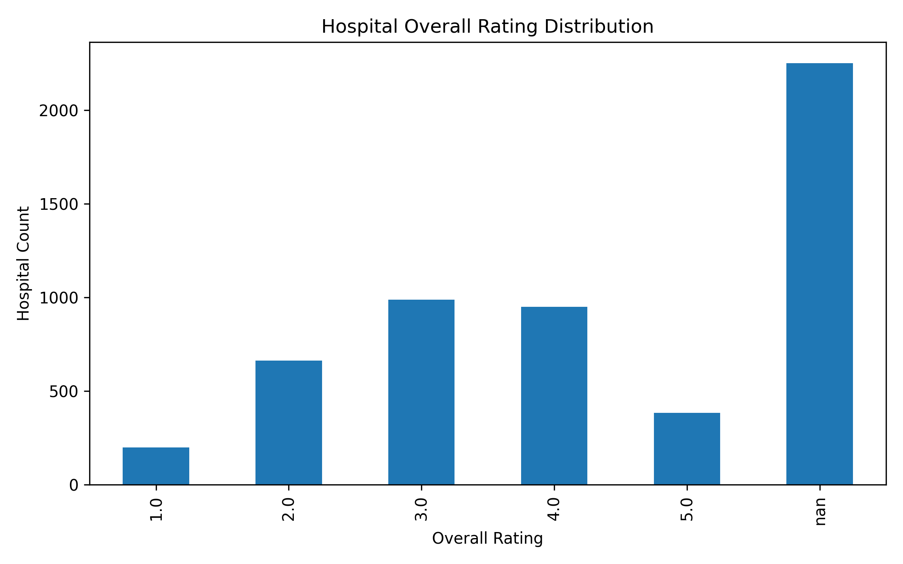
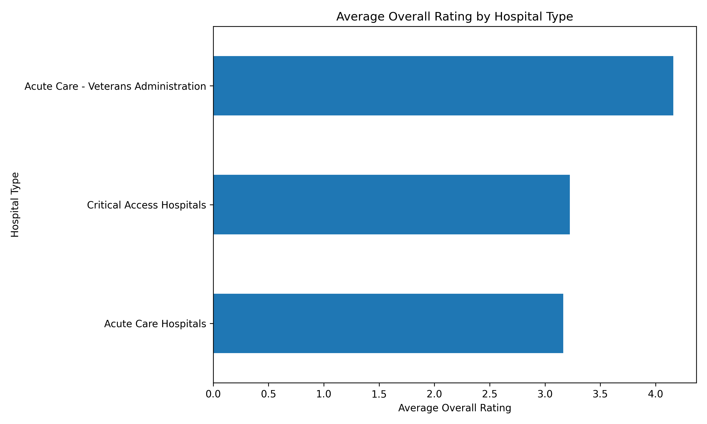

# CMS Hospital Quality Analytics

## Project Overview

This project analyzes CMS hospital quality data to explore hospital characteristics, overall ratings, missing quality-measure reporting, and differences across states, hospital types, and ownership categories.

The goal is to build a clean, reproducible data analytics project using Python, pandas, and matplotlib while demonstrating a professional workflow for data collection, cleaning, exploratory analysis, and reporting.

## Business Question

How do hospital quality ratings and reporting patterns vary across U.S. hospitals by geography, hospital type, and ownership?

## Dataset

The project uses the CMS Hospital General Information dataset from Medicare.gov provider data.

The dataset includes hospital-level information such as:

* Facility ID
* Hospital name
* Address, city, state, and ZIP code
* Hospital type
* Hospital ownership
* Emergency services availability
* CMS overall hospital rating
* Quality-measure group counts

## Tools Used

* Python
* pandas
* matplotlib
* Git and GitHub
* VS Code
* Git Bash

## Project Structure

```text
cms-hospital-quality-analytics/
├── data/
│   ├── raw/
│   │   └── hospital_general_info.csv
│   └── processed/
│       └── hospital_general_info_clean.csv
├── outputs/
│   └── figures/
│       ├── average_rating_by_hospital_type.png
│       ├── overall_rating_distribution.png
│       └── top_states_by_hospital_count.png
├── reports/
│   ├── average_rating_by_hospital_type.csv
│   ├── average_rating_by_ownership.csv
│   ├── average_rating_by_state.csv
│   ├── hospital_count_by_state.csv
│   ├── missing_values_report.csv
│   └── overall_rating_distribution.csv
├── src/
│   ├── download_data.py
│   ├── clean_data.py
│   └── eda_summary.py
├── .gitignore
├── requirements.txt
└── README.md
```

## Workflow

### 1. Data Collection

The raw CMS hospital dataset is downloaded and saved to:

```text
data/raw/hospital_general_info.csv
```

### 2. Data Cleaning

The cleaning script standardizes column names, trims text fields, preserves ZIP codes as strings, converts hospital overall ratings to numeric values, and creates a flag for whether a hospital has an available overall rating.

Run:

```bash
python src/clean_data.py
```

Cleaned data is saved to:

```text
data/processed/hospital_general_info_clean.csv
```

### 3. Exploratory Data Analysis

The EDA script creates summary reports and charts for hospital counts, rating distributions, missing values, average ratings by state, average ratings by hospital type, and average ratings by ownership.

Run:

```bash
python src/eda_summary.py
```

Outputs are saved to:

```text
reports/
outputs/figures/
```

## Visualizations

### Top 15 States by Number of Hospitals



### Hospital Overall Rating Distribution



### Average Overall Rating by Hospital Type



## Key Findings

* The CMS hospital dataset contains **5,432 hospitals** and **38 columns** after cleaning.

* Hospital counts were highest in larger states. **Texas** had the most hospitals in the dataset with **468**, followed by **California** with **378** and **Florida** with **221**.

* CMS overall ratings were not available for a large portion of the dataset. **2,250 hospitals**, or **41.42%**, had missing overall ratings. Because of this, rating-based comparisons should be interpreted only among hospitals with available ratings.

* Among hospitals with available overall ratings, ratings were most commonly concentrated around **3 and 4 stars**. The dataset included **987 hospitals rated 3 stars** and **950 hospitals rated 4 stars**.

* State-level average ratings varied among hospitals with available ratings. **Utah**, **Colorado**, and **South Dakota** had the highest average overall ratings in the generated state summary.

* Average ratings also differed by hospital type. **Acute Care - Veterans Administration** hospitals had the highest average overall rating at approximately **4.16**, followed by **Critical Access Hospitals** at approximately **3.23** and **Acute Care Hospitals** at approximately **3.16**.

* Ownership categories showed variation in average ratings. **Veterans Health Administration**, **Tribal**, and **Physician-owned** hospitals appeared among the highest-rated ownership groups based on available overall ratings.

* The missing-values report showed that several CMS quality-measure footnote and measure-count fields had high missingness. These missing values were preserved because they may reflect measure applicability, hospital type, reporting eligibility, or differences in CMS reporting requirements rather than simple data-entry errors.

## Missing Data Handling

Missing values were reviewed and summarized in a dedicated missing-values report. Missing values were preserved rather than automatically removed because many missing fields relate to CMS quality-measure reporting categories that may not apply to every hospital.

This is especially important for smaller hospitals, specialty hospitals, psychiatric facilities, children’s hospitals, and critical access hospitals, which may not report the same measure groups as larger acute-care hospitals.

## How to Run This Project

Clone the repository:

```bash
git clone https://github.com/dgraves4/cms-hospital-quality-analytics.git
cd cms-hospital-quality-analytics
```

Create and activate a virtual environment:

```bash
python -m venv .venv
source .venv/Scripts/activate
```

Install dependencies:

```bash
pip install -r requirements.txt
```

Run the scripts:

```bash
python src/download_data.py
python src/clean_data.py
python src/eda_summary.py
```

## Next Steps

Potential future improvements include:

* Building an interactive dashboard in Power BI or Tableau
* Adding maps to show hospital distribution by state or region
* Comparing ratings across ownership types in more detail
* Adding additional CMS quality datasets
* Creating a final executive summary of findings
* Automating the full pipeline with a single command or workflow script

## Project Status

Current status: Initial data collection, cleaning, exploratory analysis, reports, and visualizations are complete.

